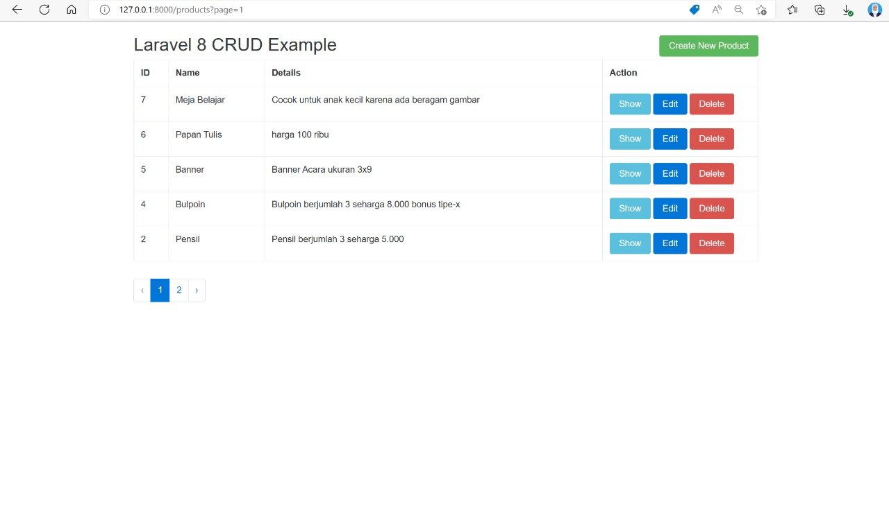
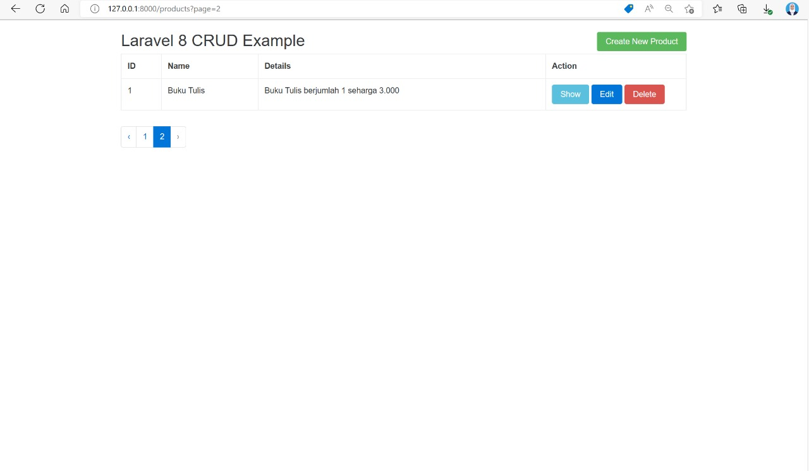
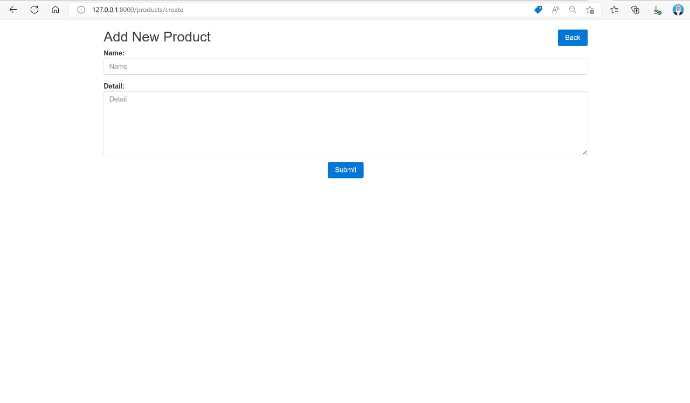
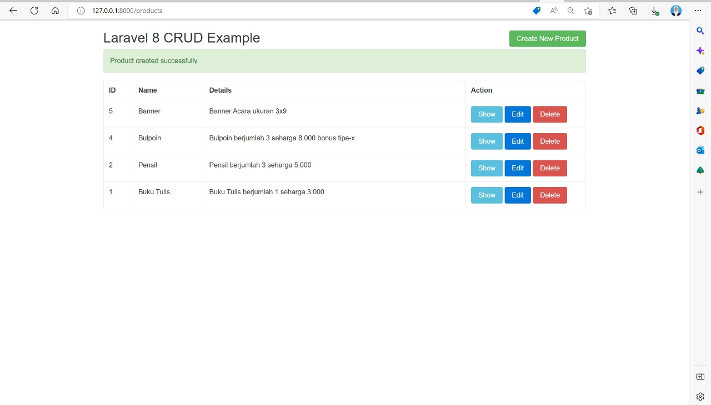

# WEBSITE CRUD (CREATE, READ, UPDATE, DELETE)

Cara Menjalankan Website :

1. Menyambungkan dengan database bernama "laravel8_crud"
2. Kode program "composer install"
3. Kode program "php migrate"
4. Atau bisa langsung ketik kode program "php artisan serve"

 

---

## BUKTI HALAMAN PERTAMA

### Halaman pertama digunakan untuk melihat daftar product yang telah terdaftar pada halaman pertama website

---

 
 

---

## BUKTI HALAMAN KEDUA

### Halaman kedua digunakan untuk melihat daftar product yang telah terdaftar pada halaman kedua website

---

 
 

---

## BUKTI HALAMAN TAMBAH DATA

### Halaman Tambah Data digunakan untuk menginputkan data pada Website CRUD

---

 
 

---

## BUKTI HALAMAN BERHASIL TAMBAH DATA

### Halaman CRUD digunakan untuk melihat daftar product yang telah bertambah sebelumnya

---

 
 

---

## SELESAI

---
